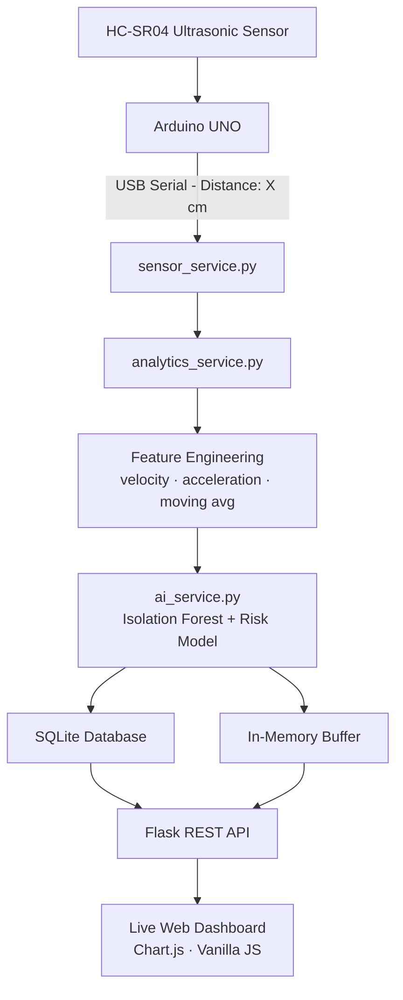
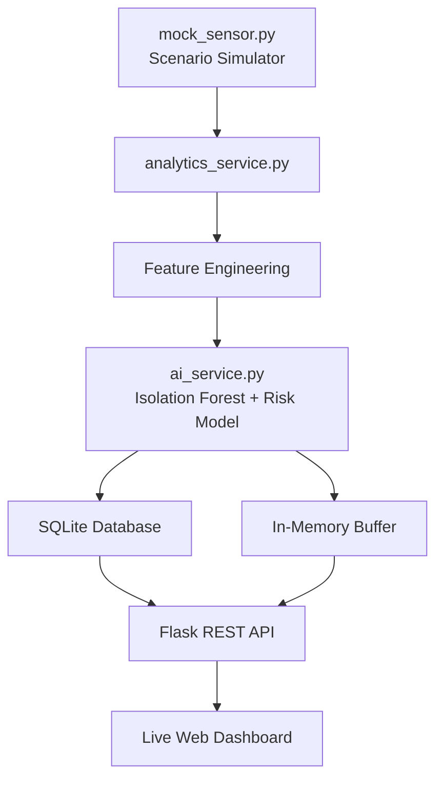

# AI Train Distance Alert System

> **IoT + Machine Learning Real-Time Web Dashboard**
> Arduino UNO · HC-SR04 · Python Flask · SQLite · scikit-learn Isolation Forest

An educational IoT prototype that demonstrates how machine learning can enhance sensor data from an ultrasonic distance sensor. The system reads distance measurements, computes velocity and acceleration in real-time, runs AI anomaly detection, and displays everything on a live web dashboard.

---

## Architecture

### Hardware Mode



### Mock Mode (No Hardware Required)



---

## Project Structure

```
train_distance_ai_web/
│
├── app.py                    ← Flask app, all API routes
├── config.py                 ← All configuration (reads from .env)
├── requirements.txt
├── .env.example              ← Copy to .env to configure
├── README.md
│
├── services/
│   ├── ai_service.py         ← Isolation Forest AI + risk scoring
│   ├── analytics_service.py  ← velocity, acceleration, pipeline hub
│   ├── mock_sensor.py        ← 6-scenario sensor simulator
│   └── sensor_service.py     ← Arduino serial reader
│
├── models/
│   └── database.py           ← SQLAlchemy model + query helpers
│
├── templates/
│   └── index.html            ← Dashboard UI (Jinja2)
│
├── static/
│   ├── css/style.css         ← Dark-mode dashboard styles
│   └── js/dashboard.js       ← Real-time Chart.js + UI logic
│
└── data/
    └── train_alert.db        ← SQLite database (auto-created)
```

---

## Installation (Windows)

### Prerequisites
- Python 3.10 or newer
- Git (optional)

### Step-by-step

```bash
# 1. Navigate into the project folder
cd "Distance IoT project\train_distance_ai_web"

# 2. Create a virtual environment
python -m venv venv

# 3. Activate it
venv\Scripts\activate

# 4. Install dependencies
pip install -r requirements.txt
```

---

## Running the Application

### MOCK Mode (No Arduino Required)

This is the default mode. Copy the example .env file and run:

```bash
# Create your .env file from the template
copy .env.example .env

# Run the app
python app.py
```

Open http://127.0.0.1:5000 in your browser.

The simulator will automatically cycle through 6 scenarios:
- **Stable** — object at a safe distance with minor noise
- **Slow Approach** — object slowly moving toward the sensor
- **Rapid Approach** — fast approach triggering WARNING/CRITICAL
- **Critical Event** — object already close, entering danger zone
- **Sensor Noise** — random fluctuations around a stable baseline
- **Auto Demo** — cycles through all scenarios automatically

Use the **Simulator Control Panel** on the dashboard to switch scenarios manually, adjust speed, and pause/reset.

### HARDWARE Mode (Arduino Connected)

Edit your `.env` file:

```env
APP_MODE=HARDWARE
SERIAL_PORT=COM5       # Change to your actual COM port
BAUD_RATE=9600
```

Then run:

```bash
python app.py
```

**Finding your COM port:** Open Device Manager → Ports (COM & LPT) → look for "USB Serial Device" or "CH340".

**Arduino sketch requirement:** The Arduino must print lines in this exact format:
```
Distance: 28.4 cm
```

---

## API Reference

| Endpoint | Method | Description |
|---|---|---|
| `/api/current` | GET | Latest processed reading (full JSON) |
| `/api/history` | GET | Recent DB readings (`?limit=100`) |
| `/api/statistics` | GET | Aggregate stats (min/max/avg) |
| `/api/system-status` | GET | System health info |
| `/api/export/csv` | GET | Download CSV (`?limit=500`) |
| `/api/simulator/control` | POST | Control mock simulator |
| `/api/simulator/state` | GET | Current simulator state |

### Example: GET /api/current

```json
{
  "timestamp": "2026-08-19T20:15:00",
  "distance": 28.4,
  "velocity": -12.5,
  "acceleration": -1.2,
  "moving_avg": 31.2,
  "risk_score": 82.4,
  "anomaly_score": 0.71,
  "status": "CRITICAL",
  "trend": "APPROACHING",
  "proximity_risk": 85.0,
  "velocity_risk": 83.3,
  "accel_risk": 15.0,
  "time_to_critical": 3.5,
  "time_to_critical_display": "3.5 s",
  "mode": "MOCK",
  "sensor_status": "SIMULATED",
  "connected": true
}
```

---

## How the AI Works (Plain English)

### 1. Feature Engineering
Raw distance alone is not very informative. The system computes:
- **Velocity** — how fast the distance is changing (cm/s). Negative = approaching.
- **Acceleration** — how fast the velocity is changing. Sudden acceleration = danger.
- **Moving average** — rolling mean of the last 5 readings to smooth noise.
- **Distance from average** — how much this reading deviates from the smoothed trend.

### 2. Isolation Forest (Anomaly Detection)
An **Isolation Forest** is a machine learning algorithm that learns what "normal" sensor behaviour looks like (object at safe distance, slow movements). It is trained on 800 synthetic "normal" readings.

When a new reading arrives, the model checks: *"Does this look like the normal patterns I was trained on?"* A reading that looks very different gets a high **anomaly score** (0–1).

### 3. Risk Sub-scores
Four separate risk components are computed (each 0–100%):
- **Proximity Risk** — how close is the object?
- **Velocity Risk** — how fast is it approaching?
- **Acceleration Risk** — is it suddenly accelerating toward us?
- **Anomaly Risk** — does the ML model flag this as unusual?

### 4. Weighted Combination
```
Risk Score = 40% × Proximity + 30% × Velocity + 15% × Acceleration + 15% × Anomaly
```

### 5. Status Classification
| Risk Score | Status |
|---|---|
| 0–39 | NORMAL |
| 40–59 | CAUTION |
| 60–79 | WARNING |
| 80–100 | CRITICAL |
| distance ≤ 30 cm | CRITICAL (safety override) |

### 6. Time-to-Critical Prediction
Using constant-velocity physics:
```
time = (current_distance - 30) / approach_speed
```

---

## Important Note

> This system is an **AI-assisted risk analysis layer for an educational IoT prototype**.
> It is not a certified railway safety decision system. The AI score is a software
> demonstration layer. In a real safety-critical system, hardware interlocks
> (like the Arduino's buzzer/LED at ≤30 cm) remain the primary protection mechanism.

---

## Configuration Reference

| Variable | Default | Description |
|---|---|---|
| `APP_MODE` | `MOCK` | `MOCK` or `HARDWARE` |
| `SERIAL_PORT` | `COM5` | Arduino serial port |
| `BAUD_RATE` | `9600` | Serial baud rate |
| `WARNING_DISTANCE` | `50` | cm threshold for caution |
| `CRITICAL_DISTANCE` | `30` | cm threshold for critical override |
| `SAMPLE_INTERVAL` | `1.0` | Min seconds between DB writes |

---

## Dependencies

| Package | Purpose |
|---|---|
| Flask | Web framework |
| Flask-SQLAlchemy | ORM for SQLite |
| scikit-learn | Isolation Forest anomaly detection |
| numpy | Numerical computing |
| pyserial | Arduino USB serial communication |
| python-dotenv | .env file loading |
